# ElderShield — System Architecture

End-to-end system design: all features, services, user flows, and data pipelines.

## Architecture Diagram

```mermaid
%%{init: {'theme': 'base', 'themeVariables': {'fontSize': '12px'}}}%%
flowchart TD

  %% ─────────────────────────────────────────────
  %% LAYER 0: ENTRY POINTS
  %% ─────────────────────────────────────────────
  subgraph ENTRY["📱 App Entry Points"]
    direction LR
    MAIN["main.dart\n(Bootstrap)"]
    NOTIF_TAP["Notification Tap\n(killed state)"]
    SMS_ARRIVE["Incoming SMS\n(Android OS)"]
  end

  %% ─────────────────────────────────────────────
  %% LAYER 1: MAIN BOOTSTRAP
  %% ─────────────────────────────────────────────
  subgraph BOOT["⚙️ Bootstrap (main.dart)"]
    LOAD_CONFIG["Load DetectorConfig\n(sync, from JSON)"]
    REFRESH_CONFIG["Refresh config\nfrom GitHub (async)"]
    NOTIF_INIT["NotificationService.init()"]
    PROVIDER_SCOPE["ProviderScope\n(Riverpod root)"]
  end

  %% ─────────────────────────────────────────────
  %% LAYER 2: APP SHELL & NAVIGATION
  %% ─────────────────────────────────────────────
  subgraph APPSHELL["🧭 App Shell & Navigation"]
    LAUNCHGATE["LaunchGate\n/ route"]
    ONBOARDING_CHECK{{"onboarding_complete\n?"}}
    ONBOARDING_FLOW["OnboardingFlow\n/onboarding"]
    MAIN_SHELL["MainShell\n/shell (Bottom Nav)"]
    HOME_TAB["Home Tab\nIndex 0"]
    MSG_TAB["Messages Tab\nIndex 1"]
    SETTINGS_TAB["Settings Tab\nIndex 2"]
    MSG_DETAIL["MessageDetail\n/messages/detail"]
    PAYWALL["GuardianPaywall\n/guardian-paywall"]
  end

  %% ─────────────────────────────────────────────
  %% LAYER 3: ONBOARDING FLOWS
  %% ─────────────────────────────────────────────
  subgraph ONBOARD["🚀 Onboarding Flows"]
    ROLE_SEL["RoleSelectionScreen\nCaregiver vs Self"]
    CAREGIVER_FLOW["CaregiverFlow\n→ Protected name\n→ Guardian = self\n→ Permissions"]
    SELF_FLOW["SelfProtectionFlow\n→ Own name\n→ Permissions\n→ Optional guardian"]
    PERM_SCREEN["Permissions Screen\nRECEIVE_SMS\nSYSTEM_ALERT_WINDOW\nREAD_PHONE_STATE"]
  end

  %% ─────────────────────────────────────────────
  %% LAYER 4: RIVERPOD PROVIDERS
  %% ─────────────────────────────────────────────
  subgraph PROVIDERS["🔌 Riverpod Providers (app_providers.dart)"]
    PROV_DB["appDatabaseProvider\n(AppDatabase singleton)"]
    PROV_REPO["messageRepositoryProvider\n(MessageRepository)"]
    PROV_SETTINGS["settingsServiceProvider\n(SettingsService)"]
    PROV_SUB["subscriptionServiceProvider\n(SubscriptionService)"]
    PROV_PREMIUM["isPremiumProvider\n(StreamProvider bool)"]
    PROV_HEARTBEAT["heartbeatServiceProvider\n(HeartbeatService)"]
    PROV_FOREGROUND["appInForegroundProvider\n(StateProvider bool)"]
    PROV_PENDING["pendingHighRiskMessageProvider\n(nullable SmsMessage)"]
    PROV_WHITELIST["whitelistedSendersProvider\n(Set of strings)"]
    PROV_UI["fontScaleProvider\nthemeModeProvider\nlanguageCodeProvider"]
    PROV_TAB["shellTabIndexProvider\n(int 0/1/2)"]
    PROV_HOME["homeControllerProvider\n(trusted contacts\n+ today's risk count)"]
    PROV_MSGS["messagesControllerProvider\n(filtered message list)"]
  end

  %% ─────────────────────────────────────────────
  %% LAYER 5: CORE DOMAIN — HEURISTIC DETECTOR
  %% ─────────────────────────────────────────────
  subgraph DETECTOR["🧠 Heuristic Detector (lib/domain/detector/)"]
    DET_ENGINE["HeuristicDetector.analyze()\nreturns DetectionResult\n(score 0.0–1.0, band, reasons[])"]
    DET_CONFIG["DetectorConfig\n(detector-config.json)"]
    subgraph SIGNALS["Detection Signals (weights)"]
      S1["Short URLs\n+0.25"]
      S2["OTP pattern\n+0.25"]
      S3["Urgency keywords\n+0.20"]
      S4["Bank/KYC keywords\n+0.20"]
      S5["Suspect sender\n+0.10"]
      S6["Payment request\n+0.20"]
      S7["Reward scam\n+0.15"]
      S8["Parcel scam\n+0.15"]
      S9["Crypto scam\n+0.15"]
      S10["In-call OTP boost\n+0.35"]
    end
    BANDS["RiskBand\nlow < 0.4\nmedium 0.4–0.7\nhigh ≥ 0.7"]
    TRUSTED_DLT["TrustedDLT bypass\n(SBIBNK, HDFCBK,\nPAYTMB + 40 more)\n→ skip all alerts"]
  end

  %% ─────────────────────────────────────────────
  %% LAYER 6: SECURITY CONTROLLER (foreground flow)
  %% ─────────────────────────────────────────────
  subgraph SEC_CTRL["🛡️ SecurityController (foreground SMS pipeline)"]
    SC_LISTEN["Subscribe to\nNativeEventStream"]
    SC_WHITELIST_CHK{{"Whitelisted\nsender?"}}
    SC_DLT_CHK{{"Trusted DLT\nsuffix?"}}
    SC_ANALYZE["HeuristicDetector\n.analyze()"]
    SC_SAVE["MessageRepository\n.saveAnalyzedMessage()"]
    SC_RISK_CHK{{"Risk band?"}}
    SC_DEDUPE{{"Dedup\n(1-min window)"}}
    SC_SAFE_CHK{{"Sender\nmarked safe?"}}
    SC_NOTIF["NotificationService\n.show()"]
    SC_GUARDIAN["GuardianAlertService\n.alertGuardian()"]
    SC_PENDING["Set pendingHighRiskMessageProvider\n→ show HighRiskAlertSheet modal"]
  end

  %% ─────────────────────────────────────────────
  %% LAYER 7: PLATFORM CHANNELS (Dart side)
  %% ─────────────────────────────────────────────
  subgraph CHANNELS_DART["🌉 Platform Bridges (lib/platform/)"]
    CH_EVENTS["NativeEventStream\nEventChannel: fraud_guard/events\nSmsEvent | CallStateEvent"]
    CH_LAUNCH["LaunchSms\nMethodChannel: elder_shield/launch\ngetLaunchSms()"]
    CH_WHITELIST["WhitelistChannel\nMethodChannel: elder_shield/whitelist\nsetWhitelist()"]
    CH_OVERLAY["OverlayAlerts\nMethodChannel: elder_shield/system\ncanDrawOverlays()\nopenOverlayPermissionSettings()"]
  end

  %% ─────────────────────────────────────────────
  %% LAYER 8: KOTLIN NATIVE LAYER
  %% ─────────────────────────────────────────────
  subgraph KOTLIN["🤖 Kotlin Native Layer (android/.../elder_shield/)"]
    MAIN_ACT["MainActivity.kt\nRegisters 6 MethodChannels\n+ 1 EventChannel\nTracks isAppVisible"]
    SMS_REC["SmsReceiver.kt\nBroadcastReceiver priority=999\nSMS_RECEIVED_ACTION"]
    SMS_EMITTER["SmsEventEmitter.kt\n(singleton)\nHolds EventChannel.EventSink\nThread-safe emission"]
    SIMPLE_CHECK["SimpleRiskCheck.kt\n(lightweight inline heuristic)\nshortURL+2, OTP+2,\nurgency+1, bank+1\nhigh if score≥1"]
    SCAM_OVERLAY["ScamOverlayService.kt\nForeground Service\nDraws SYSTEM_ALERT_WINDOW\n'Possible Scam' card"]
    CALL_LISTENER["CallStateListener.kt\nTelephonyCallback (API31+)\nPhoneStateListener (legacy)\nIdle/Ringing/Offhook"]
    WA_HELPER["WhatsAppIntentHelper.kt\nsendGuardianAlert() — rate-limited\nsendTextMessage() — unrestricted\ncomposeMessage() (no body)\n+91 normalization"]
    HB_WORKER["HeartbeatWorker.kt\nWorkManager.Worker\nReads SharedPreferences\nBuilds daily/weekly message\nFires sendTextMessage()"]
  end

  %% ─────────────────────────────────────────────
  %% LAYER 9: SERVICES
  %% ─────────────────────────────────────────────
  subgraph SERVICES["⚙️ Services (lib/services/)"]
    SVC_SETTINGS["SettingsService\nFlutterSecureStorage\n(EncryptedSharedPreferences)\nAll user preferences"]
    SVC_GUARDIAN["GuardianAlertService\nRate-limit: 10min interval\n1hr per-sender\nmax 10/day\nNo body — sender+risk+time only"]
    SVC_SUB["SubscriptionService\nGoogle Play Billing\nguardian_plan_monthly ₹99\nguardian_plan_yearly ₹799"]
    SVC_HEARTBEAT["HeartbeatService\nWorkManager scheduler\ndaily 10AM\nweekly Sunday 10AM"]
    SVC_NOTIF["NotificationService\nflutter_local_notifications\nHeads-up + ongoing"]
    SVC_URL["UrlExpander\nExpands short URLs\nbefore user taps"]
  end

  %% ─────────────────────────────────────────────
  %% LAYER 10: DATA LAYER
  %% ─────────────────────────────────────────────
  subgraph DATA["💾 Data Layer (lib/data/)"]
    DB["AppDatabase\nSQLCipher AES-256\nKey in Android Keystore"]
    TBL_MSG["analyzed_messages\n(id, sender, body, timestamp,\nscore, band, feedback_label)"]
    TBL_REASONS["message_reasons\n(id, message_id FK, reason)"]
    MSG_REPO["MessageRepository\nsaveAnalyzedMessage()\nfetchRecent()\nfetchHighRisk()\nfetchTodayRiskCount()\nhasSafeFeedback()\nsaveFeedback()"]
  end

  %% ─────────────────────────────────────────────
  %% LAYER 11: BACKGROUND/KILLED SMS FLOW
  %% ─────────────────────────────────────────────
  subgraph BG_FLOW["🔴 Background/Killed SMS Flow"]
    BG_SMS["SMS arrives\n(app killed)"]
    BG_CHECK["SimpleRiskCheck\n.looksHighRisk()"]
    BG_NOTIF["showHighRiskNotification()\nHeads-up notification"]
    BG_OVERLAY["ScamOverlayService\n.start() — draws overlay"]
    BG_VIBRATE["vibrateStrongly()"]
    BG_WA["WhatsAppIntentHelper\n.sendGuardianAlert()\n(rate-limited)"]
    BG_TAP["User taps notification\nMainActivity.onNewIntent()"]
    BG_LAUNCH["getLaunchSms()\n→ HighRiskAlertSheet"]
  end

  %% ─────────────────────────────────────────────
  %% LAYER 12: HEARTBEAT FLOW
  %% ─────────────────────────────────────────────
  subgraph HB_FLOW["💓 Heartbeat Flow (premium only)"]
    HB_STARTUP["App startup:\n_initHeartbeat()\n(if premium + guardian set)"]
    HB_REGISTER["HeartbeatService\n.initialize()\nRegisters 2 WorkManager tasks"]
    HB_DAILY["Daily 10AM task\n_syncDailyData()"]
    HB_WEEKLY["Weekly Sunday 10AM\n_syncWeeklyData()"]
    HB_DB_QUERY["Query MessageRepository\n(today's stats / week summary)"]
    HB_SYNC["Sync to SharedPreferences\nvia elder_shield/heartbeat\nMethodChannel"]
    HB_WORKER_RUN["HeartbeatWorker.doWork()\n(WorkManager background process)"]
    HB_SEND["WhatsAppIntentHelper\n.sendTextMessage()\n→ Guardian WhatsApp/SMS"]
  end

  %% ─────────────────────────────────────────────
  %% LAYER 13: SETTINGS SYNC TO NATIVE
  %% ─────────────────────────────────────────────
  subgraph SYNC_NATIVE["🔄 Native Settings Sync"]
    SYNC_WHITELIST["Whitelist updated\n→ WhitelistChannel.setWhitelist()\n→ Kotlin SharedPreferences"]
    SYNC_GUARDIAN["Guardian updated\n→ GuardianAlertService.syncToNative()\n→ elder_shield/guardian MethodChannel\n→ Kotlin SharedPreferences"]
    SYNC_HEARTBEAT["Heartbeat stats\n→ elder_shield/heartbeat MethodChannel\n→ Kotlin SharedPreferences"]
  end

  %% ─────────────────────────────────────────────
  %% LAYER 14: SUBSCRIPTION FLOW
  %% ─────────────────────────────────────────────
  subgraph SUB_FLOW["💳 Subscription Flow"]
    SUB_SETTINGS["Settings screen\nGuardian Plan tile"]
    SUB_PAYWALL["GuardianPaywallScreen\nMonthly ₹99 / Yearly ₹799"]
    SUB_BILLING["Google Play Billing\nin_app_purchase ^3.2.0"]
    SUB_VERIFY["isPremiumProvider\n(re-verified on startup)"]
    SUB_UNLOCK["Unlock features:\n• Guardian alerts\n• Daily heartbeat\n• Weekly summary"]
  end

  %% ─────────────────────────────────────────────
  %% CONNECTIONS
  %% ─────────────────────────────────────────────

  %% Entry → Boot
  MAIN --> BOOT
  MAIN --> LOAD_CONFIG --> DET_CONFIG
  MAIN --> REFRESH_CONFIG
  MAIN --> NOTIF_INIT
  MAIN --> PROVIDER_SCOPE --> LAUNCHGATE

  %% Navigation flow
  LAUNCHGATE --> ONBOARDING_CHECK
  ONBOARDING_CHECK -- "No" --> ONBOARDING_FLOW --> ROLE_SEL
  ONBOARDING_CHECK -- "Yes" --> MAIN_SHELL
  ROLE_SEL --> CAREGIVER_FLOW --> PERM_SCREEN
  ROLE_SEL --> SELF_FLOW --> PERM_SCREEN
  PERM_SCREEN --> MAIN_SHELL
  MAIN_SHELL --> HOME_TAB & MSG_TAB & SETTINGS_TAB
  MSG_TAB --> MSG_DETAIL
  SETTINGS_TAB --> PAYWALL

  %% Providers
  PROV_DB --> PROV_REPO
  PROV_SETTINGS --> PROV_PREMIUM
  PROV_SUB --> PROV_PREMIUM
  PROV_PREMIUM --> PROV_HEARTBEAT

  %% Detector internals
  DET_CONFIG --> DET_ENGINE
  S1 & S2 & S3 & S4 & S5 & S6 & S7 & S8 & S9 & S10 --> DET_ENGINE
  DET_ENGINE --> BANDS
  TRUSTED_DLT --> DET_ENGINE

  %% Foreground SMS pipeline
  SMS_ARRIVE --> SMS_REC
  SMS_REC -- "app visible" --> SMS_EMITTER --> CH_EVENTS --> SC_LISTEN
  SC_LISTEN --> SC_WHITELIST_CHK
  SC_WHITELIST_CHK -- "yes" --> SC_SAVE
  SC_WHITELIST_CHK -- "no" --> SC_DLT_CHK
  SC_DLT_CHK -- "yes" --> SC_SAVE
  SC_DLT_CHK -- "no" --> SC_ANALYZE --> DET_ENGINE
  SC_ANALYZE --> SC_SAVE --> MSG_REPO --> TBL_MSG & TBL_REASONS
  SC_ANALYZE --> SC_RISK_CHK
  SC_RISK_CHK -- "low" --> SC_SAVE
  SC_RISK_CHK -- "medium/high" --> SC_DEDUPE
  SC_DEDUPE -- "duplicate" --> SC_SAVE
  SC_DEDUPE -- "new" --> SC_SAFE_CHK
  SC_SAFE_CHK -- "yes" --> SC_SAVE
  SC_SAFE_CHK -- "no" --> SC_NOTIF & SC_GUARDIAN & SC_PENDING

  %% Call state → in-call OTP boost
  CALL_LISTENER --> CH_EVENTS
  CH_EVENTS -- "CallStateEvent" --> SC_LISTEN

  %% Background SMS pipeline
  SMS_REC -- "app killed/bg" --> SIMPLE_CHECK
  SIMPLE_CHECK -- "high risk" --> BG_NOTIF & BG_OVERLAY & BG_VIBRATE & BG_WA
  BG_NOTIF --> BG_TAP --> BG_LAUNCH --> SC_PENDING

  %% Kotlin channels to MainActivity
  MAIN_ACT --> SMS_REC
  MAIN_ACT --> CH_EVENTS
  MAIN_ACT --> CH_LAUNCH
  MAIN_ACT --> CH_WHITELIST
  MAIN_ACT --> CH_OVERLAY

  %% Settings sync
  SVC_SETTINGS --> SYNC_WHITELIST --> CH_WHITELIST
  SVC_GUARDIAN --> SYNC_GUARDIAN
  SVC_HEARTBEAT --> SYNC_HEARTBEAT --> HB_WORKER_RUN

  %% Heartbeat flow
  PROV_PREMIUM -- "isPremium" --> HB_STARTUP
  HB_STARTUP --> HB_REGISTER --> HB_DAILY & HB_WEEKLY
  HB_DAILY & HB_WEEKLY --> HB_DB_QUERY --> MSG_REPO
  HB_DB_QUERY --> HB_SYNC --> HB_WORKER_RUN --> HB_SEND --> WA_HELPER

  %% Subscription flow
  SUB_SETTINGS --> SUB_PAYWALL --> SUB_BILLING --> SUB_VERIFY --> PROV_PREMIUM
  PROV_PREMIUM -- "unlocked" --> SUB_UNLOCK

  %% Data layer internals
  DB --> TBL_MSG & TBL_REASONS
  MSG_REPO --> DB

  %% Services connecting to native
  SVC_GUARDIAN --> WA_HELPER
  SC_GUARDIAN --> SVC_GUARDIAN
  BG_WA --> WA_HELPER
  WA_HELPER --> HB_WORKER

  %% UI providers connect to screens
  PROV_HOME --> HOME_TAB
  PROV_MSGS --> MSG_TAB
  PROV_UI --> MAIN_SHELL
  PROV_PENDING --> SC_PENDING
```



---

## Layer-by-Layer Explanation

### 1. App Entry Points
Three ways the app starts:
- **Normal launch** (`main.dart`) — user opens the app
- **Notification tap** — user taps a high-risk SMS notification (app may be killed)
- **Incoming SMS** — Android OS broadcasts `SMS_RECEIVED_ACTION` to `SmsReceiver.kt` even if app is killed

---

### 2. Bootstrap (`main.dart`)
Runs synchronously first:
- Loads `DetectorConfig` from `detector-config.json` so scoring is available instantly
- Initializes `ProviderScope` (Riverpod root)

Then fires async background tasks:
- Restores cached config from secure storage
- Refreshes config from GitHub (silent update)
- Initializes `NotificationService`

---

### 3. Navigation & Onboarding
`LaunchGate` checks `onboarding_complete` flag in `SettingsService`:
- **First run** → `OnboardingFlow` → `RoleSelectionScreen`
  - **Caregiver path**: protected person name → guardian = self → permissions
  - **Self-protection path**: own name → permissions → optional guardian
- **Returning user** → `MainShell` (3-tab bottom nav: Home / Messages / Settings)

---

### 4. Riverpod Providers
All global state flows through 13 providers in `app_providers.dart`. Key dependency chain:
```
appDatabaseProvider → messageRepositoryProvider
settingsServiceProvider + subscriptionServiceProvider → isPremiumProvider → heartbeatServiceProvider
```

`appInForegroundProvider` is a critical boolean that determines whether the app shows an in-app notification vs sending a guardian alert.

---

### 5. Heuristic Detector (Core Engine)
Pure Dart, **no network, fully deterministic**. 10 weighted signals produce a `0.0–1.0` score:

| Signal | Weight |
|--------|--------|
| Short URL (bit.ly, tinyurl…) | +0.25 |
| OTP pattern | +0.25 |
| Urgency keywords | +0.20 |
| Bank/KYC keywords | +0.20 |
| Payment request | +0.20 |
| Suspect sender name | +0.10 |
| Reward/parcel/crypto scam | +0.15 each |
| In-call OTP boost | +0.35 extra |

Score is clamped to 1.0. Bands: `low < 0.4`, `medium 0.4–0.7`, `high ≥ 0.7`.

40+ trusted DLT sender suffixes (SBIBNK, HDFCBK, PAYTMB…) **bypass all alerts entirely**.

---

### 6. Foreground SMS Pipeline (app is visible)
```
SMS_RECEIVED → SmsReceiver.kt → SmsEventEmitter → EventChannel
  → NativeEventStream (Dart) → SecurityController
    → whitelist check → DLT check → HeuristicDetector.analyze()
      → MessageRepository.save() → SQLCipher DB
      → if medium/high + not duped + not safe-marked:
          → NotificationService (heads-up)
          → GuardianAlertService (WhatsApp/SMS to guardian, premium only)
          → pendingHighRiskMessageProvider → HighRiskAlertSheet modal
```

---

### 7. Background / Killed SMS Pipeline
When `SmsReceiver.kt` detects the Flutter engine is not running:
```
SmsReceiver → SimpleRiskCheck (lightweight Kotlin heuristic)
  → if high risk:
      → heads-up notification (taps reopen MainActivity)
      → ScamOverlayService (system overlay card)
      → vibrateStrongly()
      → WhatsAppIntentHelper.sendGuardianAlert() (rate-limited)
  → user taps notification → getLaunchSms() → HighRiskAlertSheet
```

`SimpleRiskCheck` mirrors the Dart detector in Kotlin, kept in sync manually.

---

### 8. Guardian Alert Rate Limiting
`WhatsAppIntentHelper` enforces:
- Min **10 minutes** between any alerts
- Min **1 hour** between alerts for the **same sender**
- Max **10 alerts per day**

Alert content: only **sender ID + risk level + timestamp + protected name**. Never the SMS body.

---

### 9. Heartbeat Flow (Premium only)
```
App startup (if premium + guardian configured)
  → HeartbeatService.initialize() → WorkManager registers 2 periodic tasks
    → Daily 10AM: query DB stats → sync to SharedPreferences via MethodChannel
    → Weekly Sunday 10AM: query weekly summary → sync to SharedPreferences
  → HeartbeatWorker.doWork() (WorkManager background process)
    → reads SharedPreferences → builds message → WhatsAppIntentHelper.sendTextMessage()
    → Guardian receives WhatsApp/SMS with "All safe" or threat summary
```

---

### 10. Subscription Flow
```
Settings → Guardian Plan tile → GuardianPaywallScreen
  → Google Play Billing (in_app_purchase)
    → guardian_plan_monthly ₹99/month
    → guardian_plan_yearly ₹799/year
  → isPremiumProvider (StreamProvider<bool>)
    → re-verified on every startup
    → unlocks: guardian alerts + daily heartbeat + weekly summary
```

---

### 11. Settings Sync to Kotlin
Since `SmsReceiver.kt` and `HeartbeatWorker.kt` run **without the Flutter engine**, all critical config is mirrored to `SharedPreferences` via MethodChannels:

| Event | Channel | Read by |
|-------|---------|---------|
| Whitelist update | `elder_shield/whitelist` | `SmsReceiver` |
| Guardian update | `elder_shield/guardian` | `WhatsAppIntentHelper` |
| Heartbeat stats | `elder_shield/heartbeat` | `HeartbeatWorker` |

---

### 12. Security Properties
- **No data leaves the device** — all scoring is local, no cloud API calls
- **SQLCipher AES-256** — database key stored in Android Keystore
- **FlutterSecureStorage** — all preferences in `EncryptedSharedPreferences`
- **No message body in alerts** — privacy-first guardian notifications
- **R8 obfuscation** in release builds
